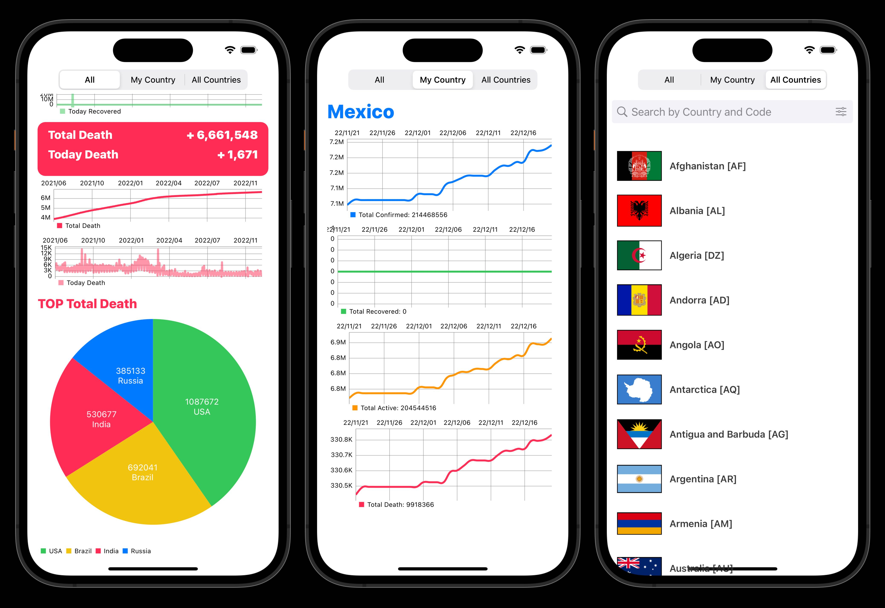

# iOSCourseWork_Last

## App for viewing COVID19 cases in any country.
*  [API](https://documenter.getpostman.com/view/10808728/SzS8rjbc#27454960-ea1c-4b91-a0b6-0468bb4e6712).
* Design: MVVM + Coordinator + Type-driven design
* Networking: [Moya](https://cocoapods.org/pods/Moya).
* Storage: CoreData, SDWebImage & UserDefaults
* UI: Snapkit, Paper-on-boarding, Charts
* Unit & UI Tests

# 
